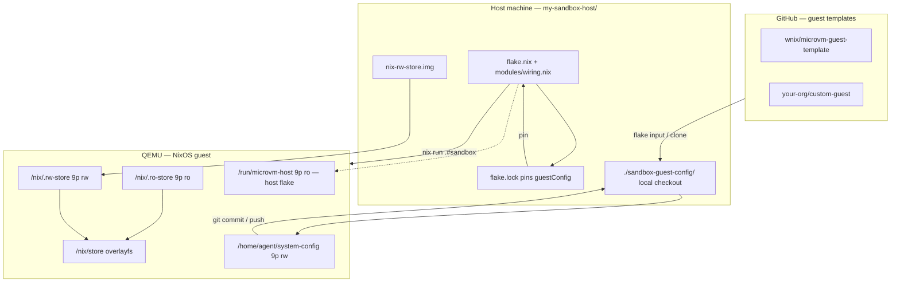

# micro-vm-template (host / hypervisor)

Standalone Nix flake: builds and runs a **NixOS microvm** (via [microvm.nix](https://github.com/microvm-nix/microvm.nix)) for an isolated, reproducible sandbox. The **hypervisor** definition lives only in this repository and is **not** bind-mounted as the guest’s editable system config.

The **guest** uses a **separate** git repository (flake input `guestConfig`), checked out under `./sandbox-guest-config/` by default, bind-mounted at `/home/agent/system-config` inside the VM.

## Why two repositories?

1. **Security:** The guest must not see the full host flake (QEMU layout, extra host paths). Only the guest repo is shared read-write for the agent; the host flake is additionally shared **read-only** at `/run/microvm-host` so in-VM `nixos-rebuild` uses the same wiring the hypervisor runs.
2. **Lifecycle:** You commit on the host; the agent can `git commit` / `git push` the guest config from inside the VM.
3. **Pluggable guest:** Swap the guest flake (template or fork) with `--guest-config` or by changing the `guestConfig` input pin in `flake.lock`. The contract is: exports `userConfig` (from `config.nix`) and `nixosModules.profile`.

## Guest templates

| Template | What's included | Status |
|---|---|---|
| [`wnix/microvm-guest-template`](https://github.com/wnix/microvm-guest-template) | Base NixOS guest: git, zsh, dev tools, nix flakes, `agent` user | available |
| `wnix/microvm-guest-claude` | Everything above + Claude Code, OpenClaw, SKILL files | coming soon |

Adding a custom guest is a **flake input** (and optional local checkout), not a submodule.

## Setup

### Path A — Nix flake template (recommended)

```bash
mkdir my-sandbox-host && cd my-sandbox-host
nix flake init --template github:wnix/microvm-host-sandbox#agent-sandbox
git init && git add -A && git commit -m "init host"
```

### Path B — GitHub template

Use **Use this template** on [`wnix/microvm-host-sandbox`](https://github.com/wnix/microvm-host-sandbox), clone your copy, then:

```bash
cd my-sandbox-host
nix flake lock   # pins guestConfig to github:wnix/microvm-guest-template
```

### Clone an existing host repo

```bash
git clone git@github.com:my-org/my-sandbox-host.git
cd my-sandbox-host
```

---

## Run and connect

From the host repo root:

```bash
nix run .#sandbox
```

The launcher clones the default guest into `./sandbox-guest-config/` if it is missing, then runs the VM with `--impure` and `--override-input guestConfig` so your **local** checkout is what Nix evaluates (matches the 9p mount).

SSH (default: host port 2222 → guest 22):

```bash
ssh -o StrictHostKeyChecking=accept-new -o UserKnownHostsFile=/dev/null -p 2222 agent@127.0.0.1
```

No SSH key in `vm.agentSshKeys` (guest `config.nix`)? The default dev password is `agent`.

### Apply guest config from inside the VM

Prefer the wrapper (uses the host flake mounted at `/run/microvm-host`):

```bash
sudo nixos-rebuild-sandbox switch
```

Equivalent:

```bash
sudo nixos-rebuild switch --flake /home/agent/system-config \
  --override-input microvmHost path:/run/microvm-host
```

Rollback:

```bash
sudo nixos-rebuild switch --rollback
```

### Use a different guest

Local path:

```bash
nix run .#sandbox -- --guest-config /absolute/path/to/guest-flake
```

GitHub shorthand (clones into `./sandbox-guest-config/`):

```bash
nix run .#sandbox -- --guest-config github:my-org/my-guest
```

### Pin the guest revision (host)

After the agent pushed guest changes and you want a reproducible pin:

```bash
nix flake lock --update-input guestConfig
git add flake.lock && git commit -m "pin guestConfig"
```

Anyone who clones this host repo gets the same guest revision from `flake.lock`.

### Developing host and guest side by side

If `flake.lock` still points at **path** inputs from a previous `nix flake lock --override-input …` on your machine, regenerate a **portable** lock once both repos are on GitHub:

```bash
nix flake lock --update-input guestConfig
```

For a sibling checkout **before** that publish, from the host directory:

```bash
nix flake lock \
  --override-input guestConfig "path:$(pwd)/../sandbox-guest-config"
```

---

## Layout (this repo)

| Path | Role |
|---|---|
| [flake.nix](flake.nix) | Inputs (`guestConfig`, `microvm`, `nixpkgs`), `nixosConfigurations.sandbox`, launcher `apps.sandbox` |
| [modules/wiring.nix](modules/wiring.nix) | **Single** `microvm` wiring (9p shares, volumes, ports) — exported as `nixosModules.wiring` |
| `flake.lock` | Pin for `guestConfig` (and transitive inputs) |

Guest-side OS (users, SSH, packages, bootstrap) lives in the **guest** repo as `nixosModules.profile`.

`./sandbox-guest-config/` is created by the launcher and listed in `.gitignore` so the default working tree is not committed.

## Architecture



- **Root filesystem** is tmpfs; persistent state: `/nix/.rw-store`, the guest checkout, and optional `vm.hostMounts` (guest `config.nix`).
- **Nix store overlay:** host `/nix/store` is the lower layer; builds in the guest use the writable upper layer.
- **Wiring:** only [modules/wiring.nix](modules/wiring.nix); the guest imports it via `inputs.microvmHost.nixosModules.wiring` (GitHub pin or `/run/microvm-host` override in the VM).

## Configuration notes

| Topic | Notes |
|--------|--------|
| **VM knobs** | Edit **`config.nix` in the guest repo** (`vm.cpus`, `vm.memoryMiB`, `vm.diskSizeGiB`, `vm.forwardedPorts`, `vm.hypervisor`, `vm.hostMounts`, …). |
| **Hypervisor** | Default **Qemu** + user networking ([`forwardPorts` supported](https://microvm-nix.github.io/microvm.nix/)). |
| **Nix** | Do not enable `auto-optimise-store` with a writable store overlay (microvm.nix restriction). |
| **KVM in guest** | `agent` is in `kvm`; nested KVM is enabled for `nixos-rebuild build-vm` / `nixos-test` when the CPU allows it. |

## systemd on the (Linux) host

The runner is a normal package; host NixOS is not required. See the microvm.nix docs for `microvm@` service patterns.

## Verify isolation

Inside the guest you should see: `/home/agent/system-config` (guest repo), `/run/microvm-host` (host flake, read-only), the Nix store layout, `/nix/.rw-store`, and any configured extra mounts — not the full host home directory unless you mounted it via `vm.hostMounts`.

## Disk size warning

`vm.diskSizeGiB` (guest `config.nix`) sets `nix-rw-store.img` size **only when the image is first created**. To grow: delete the image (losing built paths in the guest) or resize offline with `e2fsck -f` and `resize2fs`.

## Known limitations

- Port forwards need **Qemu** + **user** networking for the stock `forwardPorts` story.

## License

Reuse in your own projects; apply your preferred license.
